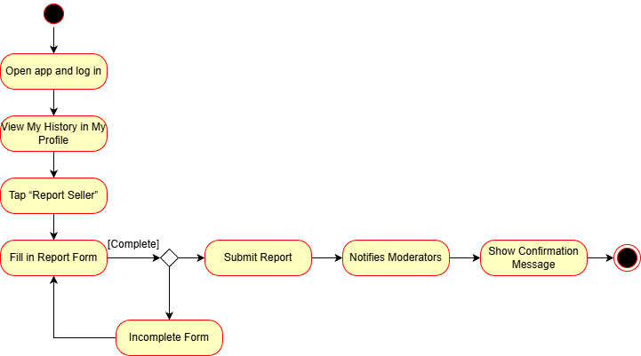
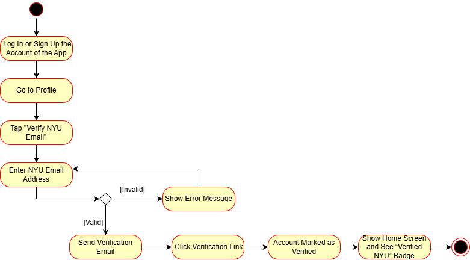
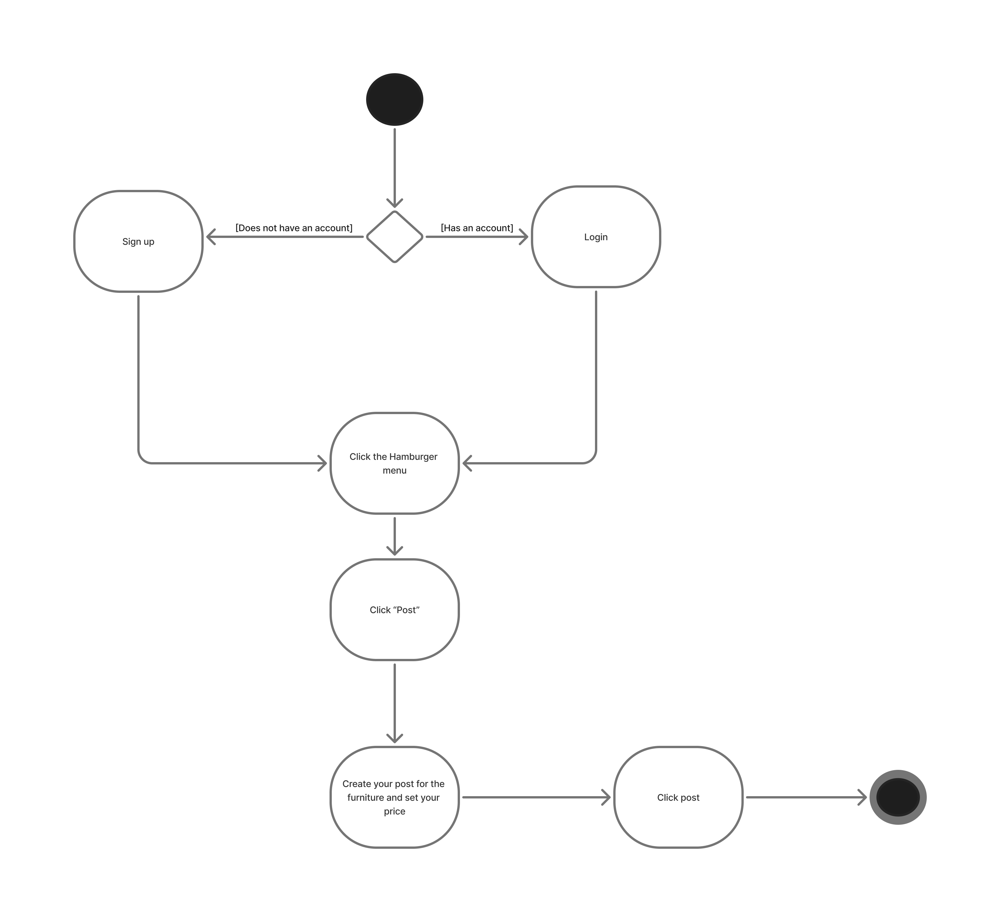

# Specification Phase Exercise

A little exercise to get started with the specification phase of the software development lifecycle. See the [instructions](instructions.md) for more detail.

## Team members

[Tuo Zhang](https://github.com/TuoZhang0902)

[Yuliang Liu](https://github.com/yl11529)

[Valeria Chang](https://github.com/ValeriaChang)

[Hudhaifah Rehman](https://github.com/hrehman1)

[Claire Boczkowski](https://github.com/ClaireBocz)
## Stakeholders

### Annie (Furniture Buyer)

#### Goals/Needs:
- Knowing how quickly and easily she can get the item because students often do not have a car.
- Knowing the quality of the item and how the past user used it such as if they had pets or smoked. 
- Dimensions of the product so she can know if it not only fits in her space but also constraints of living in nyc (small stairwell, no elevator, has to fit through the door, etc.).
- The furniture should fit her aesthetic and existing furniture. 
- Knowing when the item was purchased or how old it is.

#### Problems/Frustrations: 
- Unable to tell the cleanliness of the used furniture ex. bed bugs.
- Safety concerns: if she were picking up the item herself, she would send her dad to do it. 
- No accountability as strangers could be catfishing or lying about the product. 
- Finds that it takes more effort to buy something second hand than new. 
- Difficult to gauge what the price of something should be when it's second hand.

### Ray (Furniture Seller)
#### Goals/Needs:
- Large, active community so it can sell quickly.
- Protection from ghosting or scams such as optional or required payment/deposit especially for larger items.
- Rating system on profiles so you can see history of how reliable a person was during past interactions. 
- Being able to get a decent amount of money. Ideally 50% of the original price. 

#### Problems/Frustrations:
- She usually uses Facebook Marketplace. The problem is always with timing because as a student some items are last minute sales such as a bed. Dealing with storage can be a bigger problem if she doesn’t sell before the lease is up.
- Convenience of picking up. Having pickup locations that are convenient for her and buyers. 
- Safety concerns during exchanges. Sometimes she has to do it at her house if it's a bigger item so safety can be a concern especially since they are usually strangers. 
- Lack of pickup location information on Facebook marketplace. It’s sometimes difficult for buyers to know where they need to go to pick up things. Having a place to explain where the pickup point would be could help both parties. 

## Product Vision Statement

This app provides a verified second-hand furniture marketplace that enables safer and faster transactions by combining structured listings, in-app communication, and reputation feedback to create a sustainable furniture ecosystem within the NYU community.

## User Requirements

- As an NYU student, I want to verify my account with my school email so that I can trust that users are part of the NYU community.

- As a user, I want reminders for scheduled meetups so that I don’t forget about them among other responsibilities.

- As a furniture buyer, I want to see the verification badge and reputation score so that I can avoid any unsafe or risky transaction.

- As a furniture buyer, I want to chat with sellers directly in the app so that I can negotiate prices and coordinate pickup times

- As a furniture buyer, I want to see detailed condition information (such as pet exposure, smoking history, and purchase date)

- As a furniture buyer, I would like to see pickup location details and accessibility information so that I can plan transportation and pickup more easily.

- As a furniture buyer, I want to filter furniture by style or descriptions so that I can find items that match my existing space and taste.

- As a furniture buyer, I want to be able to wishlist items to come back to later so that I can compare options before deciding.

- As a furniture buyer, I want to report sellers so that the community remains reputable.

- As a furniture buyer, I want to see pictures of the furniture so that I can see the overall appearance of it.

- As a furniture buyer, I want to know the dimensions of the furniture so that I can know if it fits in my space or not.

- As a furniture seller, I want to see the suggested prices based on similar items so that I can price my items/lists fairly.

- As a furniture seller, I want to see the suggested prices based on similar items so that I can price my items/lists fairly.

- As a furniture seller, I want to mark my listings as "urgent" or "moving soon" so that buyers understand my timeline and I can avoid storage costs after my lease ends.

- As a furniture seller, I want to specify clear pickup location details and time windows so that I can reduce no-shows and make the exchange process more convenient

- As a furniture seller, I would like to specify whether price negotiation is allowed so that I can manage buyer expectations and save time.

- As a furniture seller, I would like to mark items as urgent or time sensitive so that buyers understand the need for a quick sale/pickup.

- As a furniture seller, I want to see how many people viewed my listing without wishlisting or contacting, so that I can adjust the price or photos if necessary.

- As a furniture seller, I want to be able to set a price on the furniture so that I can attract serious buyers  

- As a furniture seller, I want to write a description of the furniture so that I can tell buyers more about the product's condition or specifications.

## Activity Diagrams
### Buyers
User Stories:

1. As a furniture buyer, I want to report sellers so that the community remains reputable.

2. As an NYU student, I want to verify my account with my school email so that I can trust that users are part of the NYU community.

### Sellers
User Story: As a furniture seller, I want to be able to set a price on the furniture so that I can attract serious buyers  

User Story: As a furniture seller, I want to write a description of the furniture so that I can tell buyers more about the product's condition or specifications.  

## Clickable Prototype

https://www.figma.com/proto/0zwuLR0iqFDRBPxddxjoRa/Second-Hand-Furniture-APP?node-id=31-413&p=f&t=xlezv8RY2OhUQLij-1&scaling=scale-down&content-scaling=fixed&page-id=0%3A1&starting-point-node-id=67%3A31&show-proto-sidebar=1
